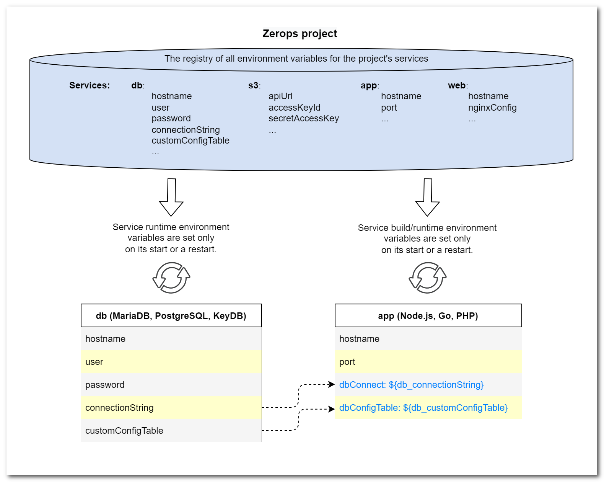
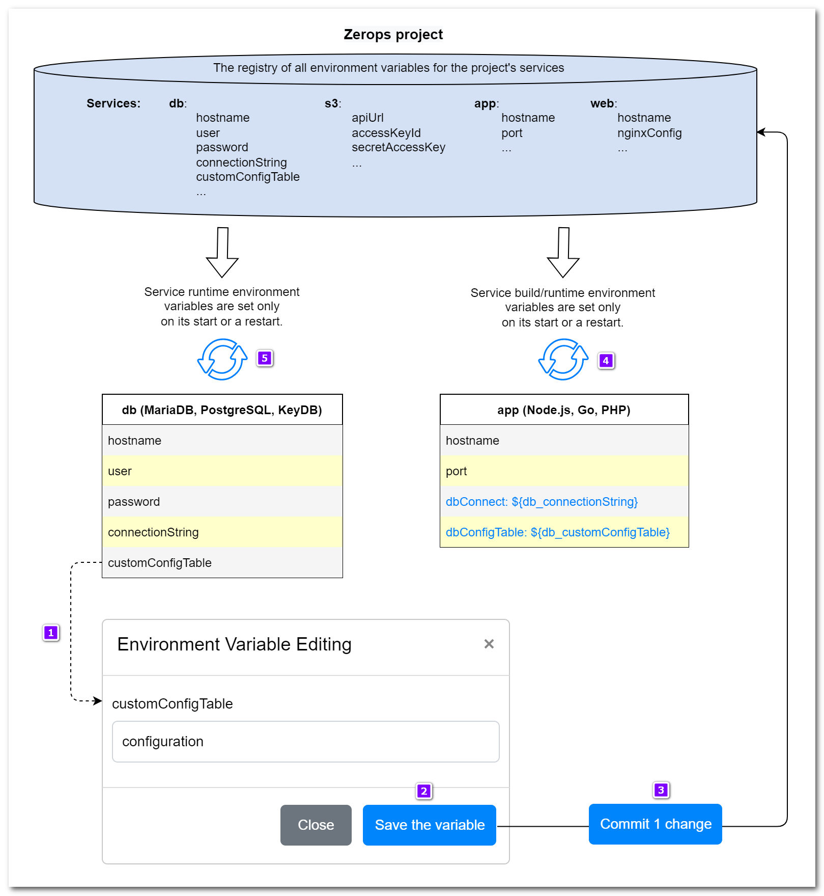
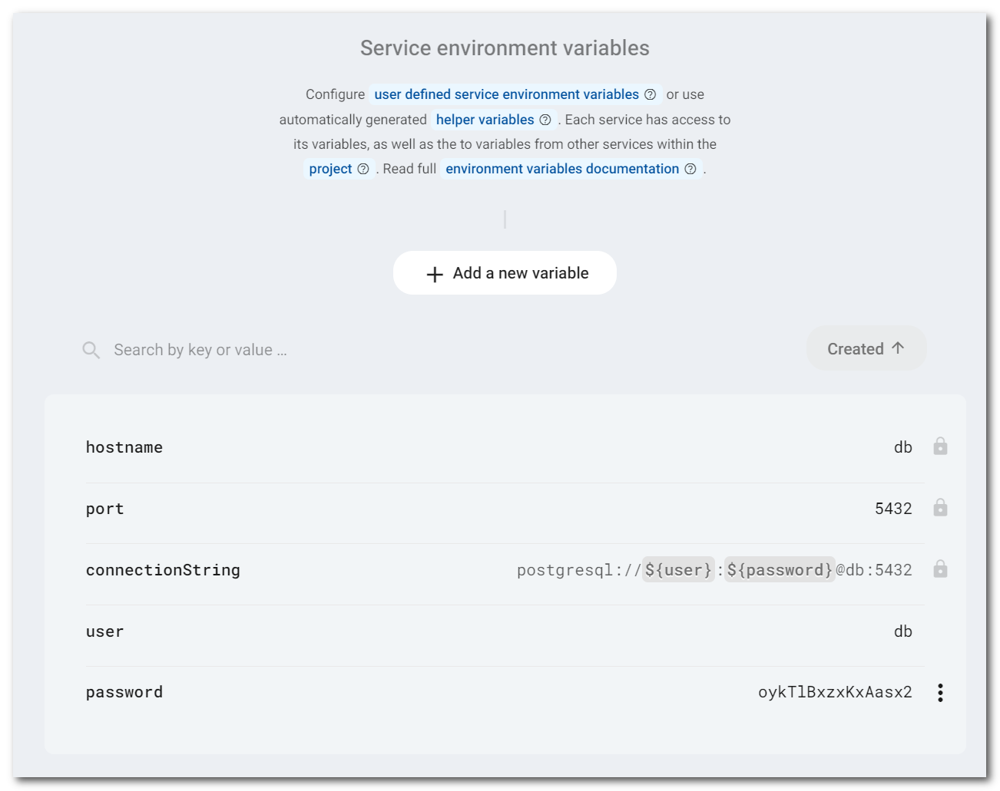

# Zerops environment variables

[[TOC]]

## Overview of how it works

All environment variables for one Zerops project and all of its services are kept and maintained inside the database registry, which is used as the only source of truth. If a new variable is created, an existing one is changed or deleted; it happens primarily in this registry.

Whether the service is created in the Zerops GUI or via an [import YAML script](/documentation/export-import/project-service-export-import.html), all [variables automatically generated](/documentation/environment-variables/helper-variables.html) by Zerops for this service or any [additional user ones](/documentation/environment-variables/overview.html#environment-variable-changes) are first stored in this register. From here, they are propagated to the [deployed service](/documentation/backup-restore/deploy-versioning.html) as its environment set. If this deployment is successful, and the service starts at least once, they are also accessible from the other existed project's services.

Be careful because each service environment variable set is being adjusted from the registry only in a moment when such a service starts or is restarted. This means that until this restart takes place, the service doesn't have access to such changes.

It is essential to be aware of this, especially when using [YAML import scripts](/documentation/export-import/project-service-export-import.html) that create multiple services. The order in which they are successfully created directly affects the accessibility of their environment variable sets from the services that are still being created. You can use the [`priority` property](/documentation/export-import/project-service-export-import.html#priority) to exactly control that order.

If the services are created manually from the Zerops GUI, their order and the logic is more evident, and it's clear that you can't assume the accessibility of environment variables for not instantiated services yet.

Each service has access to other services' environment variables within the same project using their hostname prefixes. For example, if we want to access the environment variable called `connectionString` defined on the **db** service from another service, we must [reference](#referencing-environment-variables) that variable using the `db_connectionString` variable key.

The following schema presents an example of a project with four services. Their hostnames are **db** ([MariaDB](/documentation/services/databases/mariadb.html), [PostgreSQL](/documentation/services/databases/postgresql.html), or [KeyDB](/documentation/services/databases/keydb.html)), **s3** ([Object Storage](/documentation/services/storage/s3.html)), **app** ([Node.js](/documentation/services/runtimes/nodejs.html), [Go](/documentation/services/runtimes/golang.html), or [PHP](/documentation/services/runtimes/php.html)), and **web** ([Nginx static server](/documentation/services/static-servers/nginx.html)). The shown registry shows only subsets of existed environment variables for each service. The boxes below represent the two picked up services with their details and the logic of [referencing](#referencing-environment-variables) the **db** services variables `connectionString` and `customConfigTable` from the **app** service's custom defined `dbConnect` and `dbConfigTable` variables.



## Environment variable changes

Changes to environment variables (including creating new or deleting already existing ones) are not applied directly but must be committed to the registry first. Then the affected services must be manually restarted. During the restart, a new service environment set is propagated.

The following schema shows the workflow of the already existing variable value change:



where the points mean:

1. A user edits the value of the environment variable `customConfigTable` defined in the `db` service.
2. The **`Save the variable`** button creates a change request.
3. A user must commit the change request to the registry. It's possible to do it by clicking on the dynamically shown button **`Commit 1 change`**. If you add, change, or remove more variables at once, this button is automatically updated to **`Commit N changes`** and allows you to commit all of them in one step, with only one service restart.
4. A user should restart the `app` service to get the latest environment set propagated, including the updated value of the referenced `db_customConfigTable` variable for use inside the `app` service code.
5. A user should also restart the `db` service if the `customConfigTable` variable is used somehow inside the `db` service. If not, then it's not necessary to do it immediately.

## Using variables in runtime services

Accessibility of environment variables inside runtime services depends on the used programming language. There are three variants:

- [Node.js](/documentation/services/runtimes/nodejs.html) — `process.env.key`
- [Golang](/documentation/services/runtimes/golang.html) — `os.LookupEnv('key')`
- [PHP](/documentation/services/runtimes/php.html) — `getenv("key")`

As the key , you can either directly use an environment variable name (such as port) or a composite key <prefix_name>, where the prefix is the service hostname, in which the environment variable name is defined followed by “_” and the name itself (such as db_connectionString).

<!-- markdownlint-disable DOCSMD004 -->
::: tip The default value of the [variables_order] PHP directive
The [variables_order](https://www.php.net/manual/en/ini.core.php#ini.variables-order) directive is set by default to the value of ==`GPCS`== in the `php.ini` for Zerops PHP services. It means that the super-global variable `$_ENV` is not populated.
:::
<!-- markdownlint-enable DOCSMD004 -->

## Referencing environment variables

Service environment variables can be managed inside the `Service Variables` panel in the Zerops GUI. The content of the environment variables could either be a reference to a variable defined in the same service or in a different service within the same project. The resulting environment variable will be translated from that reference. Using the example above, if we define the value of the service environment variable `${db_connectionString}`, the resulting environment variable value would be translated to the `connectionString` value defined in the `db` service.

The environment variable key should match the regular expression below.

```bash
[a-zA-Z_]+[a-zA-Z0-9_]*
```

The content of the environment variable should only consist of ASCII characters without a new line at the end.



## Relation of environment variables to application versioning

Zerops runtime environment services ([Node.js](/documentation/services/runtimes/nodejs.html), [Golang]((/documentation/services/runtimes/golang.html)), [PHP]((/documentation/services/runtimes/php.html))) are predetermined for running your custom applications and you can use the Zerops [deploy](/documentation/deploy/how-deploy-works.html) or [build](/documentation/build/how-zerops-build-works.html) tooling to publish new versions of them.

Zerops uses the term **`App version`** for their naming. The version identification depends on the decision if a new build was invoked by a new [GitHub](/documentation/github/github-integration.html)/[GitLab](/documentation/gitlab/gitlab-integration.html) repository tag/commit, or only a new [deployment](/documentation/deploy/how-deploy-works.html) of already prepared application code was used. In any case, if a new application version has been successfully deployed and activated in the end, the previous one had been archived.

A moment before archiving the previous **App version**, a snapshot of the actual service environment variables is taken and archived together with the application. If you decide to reactivate any already archived **App version** in the future, you'll also restore its environment variables at the moment of the archiving.

## Build pipeline containers and environment variables accessibility

The path along which the application is [built](/documentation/build/how-zerops-build-works.html) in Zerops represents using several different containers. To allow a consistent environment and behavior throughout the whole process, Zerops provides the same set of environment variables for all of them. And that is true even for the first application build when no previous successful deployment has happened yet.

If you decide to create any additional environment variable using commands in the [zerops.yml](/documentation/build/build-config.html) sections `build/prepare`, `build/build`, `run/prepare`, or `run/init`, you should know that the same environment variable set is propagated always even in each initiated `shell` session. It means that different shell sessions don't share any variable changes with each other. You can only chain several commands into one shell session to share such changes between different commands. When the session is closed, all custom variable changes are forgotten.

<!-- markdownlint-disable DOCSMD004 -->
::: warning Unidirectional environment variables distribution
Environment variables are propagated only from the centralized database registry toward the project's services. There is no way to update the service environment variables in this registry except to [commit](#environment-variable-changes) the changes from the Zerops GUI.
:::
<!-- markdownlint-enable DOCSMD004 -->

## Environment variable modificators in import YAML scripts

Sometimes is helpful to have additional functionality to transform environment variable values defined through import scripts. That's why Zerops offers the `stringify` modificator. See more about this [feature](/documentation/export-import/project-service-export-import.html#envvariables).

## Environment variables replacement feature for static content

This allows you to replace marked places in static files of deployed runtime applications (Node.js, Golang, PHP) with environment variable values. See more about this [feature](/documentation/build/build-config.html#envreplace-optional-for-all-services).
