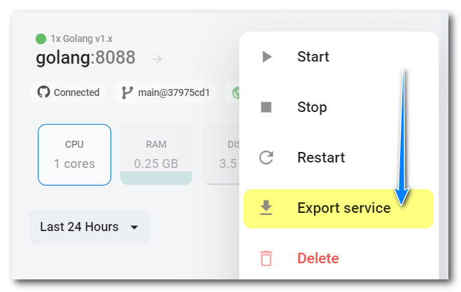

# Export & import of Zerops projects and services structure

Zerops export and import functionality can be used to make a copy of an existing project/service or as an alternative way to adding a new project/service manually through the Zerops GUI. It is important to note that only structure, configuration, and environment variables are exported/imported. Restoring application data related to databases ([MariaDB](/documentation/services/databases/mariadb.html#how-to-backup-restore-database-data), MongoDB, Redis), storage ([Object Storage](/documentation/services/storage/s3.html#using-rclone-as-a-local-management-tool), Shared Storage), and engines (Elasticsearch, RabbitMQ),  deploying applications, and setting up [public routing](/documentation/routing/using-your-domain.html) is up to a user.

[[TOC]]

## How to export / import a project

You can find several places in the Zerops GUI where you can do it. The primary one for export is the main project menu, as shown in the following picture. The project is exported including all of its services.


You can import the whole project, including all its services, on the same page you use for creating a new project manually.


## How to export / import a service

The right place to export a project service is its service menu, as shown below.



Importing a project service can be done again in the project menu, as shown in the [picture at the top](#how-to-export-import-a-project).

## Used YAML specification

Zerops uses a YAML definition format to describe the structures. If you make a project export, you can get something similar to the following. You can see two main parts, `project` and `services`. If you export a service separately, only the `services` part is there with that one exported service.

```yaml
project:
  name: copy of iKBase Class
  description: Intelligent Knowledge Base
  tags:
  - DEMO
  - ZEROPS
services:
- hostname: golang
  type: go@1
  mode: NON_HA
  ports:
  - port: 8088
    httpSupport: true
  - port: 9090
    protocol: UDP
    httpSupport: false
  envVariables:
  - key: jwt_token_secret
    content: M3rW31Ne%T@bRk
  - key: password_encryption_secret
    content: X322%wE@8@Ur6Pv
  startCommand: ./bin/main.exe
- hostname: phpapache
  type: php-apache@8.0
  mode: NON_HA
  documentRoot: /var/www/public
- hostname: objectstorage
  type: object-storage@1
  mode: HA
  objectStorageDiskGBytes: 2
- hostname: sharedstorage
  type: shared-storage@1
  mode: HA
```

**`project`**

Project structure uses `name`, `description`, and `tags` items.

`name`: string

Existed project name, pre-pended by a prefix of `copy of` to differentiate it.

`description`: string (optional)

Project description, if entered.

`tags`: Array[string] (optional)

A sequence of project tags, if entered. Each of them on a separate line with the opening dash.

**`services`**

A sequence of project services (1~N). Several general items are shared across all service structures, and exception ones are used only in some.

`hostname`: string

A chosen short and descriptive URL-friendly unique service name. Related to [MariaDB](/documentation/services/databases/mariadb.html#hostname-and-port), [MongoDB](/documentation/services/databases/mongodb.html#hostname-and-port), Redis, [Node.js](/documentation/services/runtimes/nodejs.html#port), [Golang](/documentation/services/runtimes/golang.html#port), [PHP](/documentation/services/runtimes/php.html#hostname-and-port), Elasticsearch, RabbitMQ, [Object Storage](/documentation/services/storage/s3.html#object-storage-name), and [Shared Storage](/documentation/services/storage/shared.html#shared-storage-name).

`type`: dictionary

Service type and chosen version. Each of the following service documentation specifies the available options: [MariaDB](/documentation/services/databases/mariadb.html#version-to-choose), [MongoDB](/documentation/services/databases/mongodb.html#version-to-choose), Redis, [Node.js](/documentation/services/runtimes/nodejs.html#version-to-choose), [Golang](/documentation/services/runtimes/golang.html#version-to-choose), [PHP](/documentation/services/runtimes/php.html#version-to-choose), Elasticsearch, RabbitMQ, [Object Storage](/documentation/services/storage/s3.html#version-to-choose), and [Shared Storage](/documentation/services/storage/shared.html#version-to-choose).

`mode`: dictionary

Affects whether a service should be run in ==**`HA`**== (High Availability) mode, using 3 or more containers, or ==**`NON_HA`**== mode, using only 1 container. Related to [MariaDB](/documentation/services/databases/mariadb.html#ha-non-ha-database-mode), MongoDB, Redis, [Node.js](/documentation/services/runtimes/nodejs.html#ha-non-ha-runtime-environment-mode), [Golang](/documentation/services/runtimes/golang.html#ha-non-ha-runtime-environment-mode)), [PHP](/documentation/services/runtimes/php.html#ha-non-ha-runtime-environment-mode), Elasticsearch, RabbitMQ, [Object Storage](/documentation/services/storage/s3.html#used-technology) (**always runs only in HA mode**) , and [Shared Storage](/documentation/services/storage/shared.html#default-hardware-configuration-and-autoscaling).

`ports`: Array[ServicePort] (optional)

A sequence of service ports (1~N). Each one contains `port`, `protocol`, and `httpSupport` items.

Related only to [Node.js](/documentation/services/runtimes/nodejs.html#port) and [Golang](/documentation/services/runtimes/golang.html#port) runtime environment services, where you can change it. The rest of the services have the ports preset, and you can't change them. That's the reason why this part is not included at their level, and if entered, it's ignored.

`port`: integer

Chosen port number.

`protocol`: dictionary (optional)

Chosen protocol. The default value is the ==`TCP`== and it does not have to be entered. The other possible option is the ==`UDP`== value.

`httpSupport`: boolean (optional)

The default value ==`true`== indicates if a web server runs on the port (HTTP application protocol is supported), otherwise value ==`false`== is used. If enabled, it means that you can even map [public Internet domains](/documentation/routing/using-your-domain.html#using-your-domain-to-access-a-service) with the option of automatic support for SSL certificates (it also works for [Zerops subdomains](/documentation/routing/zerops-subdomain.html#zerops-subdomain-for-previews)).

`envVariables`: Array[EnvironmentVariable] (optional)

A sequence of [service environment variables](/documentation/environment-variables/how-to-access.html) (0~N). Each one contains `key` and `content` items.

`key`: string

Environment variable key.

`content`: string

Environment variable content.

`documentRoot`: string (optional)

It's related only to the [PHP/Apache](/documentation/services/runtimes/php.html#setting-php-apache-document-root) service. The value represents a folder name used as the root of the publicly accessible web server content, usually the location of your `index.php`. By default, the document root is set to the `public` name when you create the service manually in the Zerops GUI.

`nginxConfig`: string (optional)

It's related only to the [PHP/Nginx](/documentation/services/runtimes/php.html#default-nginx-config)) service. The value represents the required content of the configuration `nginx.conf` file used by the Nginx server. The part of that configuration is also setting the value of a document root.

For example, this could be an exported value if a user would accept the default setting when creating the service in the Zerops GUI.

```yaml
services:
  - hostname: phpnginx
    type: php-nginx@8.0
    mode: NON_HA
    nginxConfig: |
      server {
        listen 80;
        listen [::]:80;
        
        server_name _;
        # Be sure that you set up a correct document root!
        root /var/www/public;
        
        location / {
          try_files $uri /index.php$is_args$args;
        }
        
        location ~* \.php$ {
          fastcgi_pass unix:/var/run/php/php8.0-fpm.sock;
          fastcgi_split_path_info ^(.+\.php)(/.*)$;
          include fastcgi_params;
          
          fastcgi_param SCRIPT_FILENAME $realpath_root$fastcgi_script_name;
          fastcgi_param DOCUMENT_ROOT $realpath_root;
          internal;
        }
        
        access_log syslog:server=unix:/dev/log,facility=kern default_short;
        error_log syslog:server=unix:/dev/log,facility=kern;
      }
```
