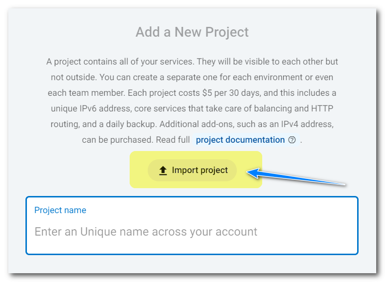
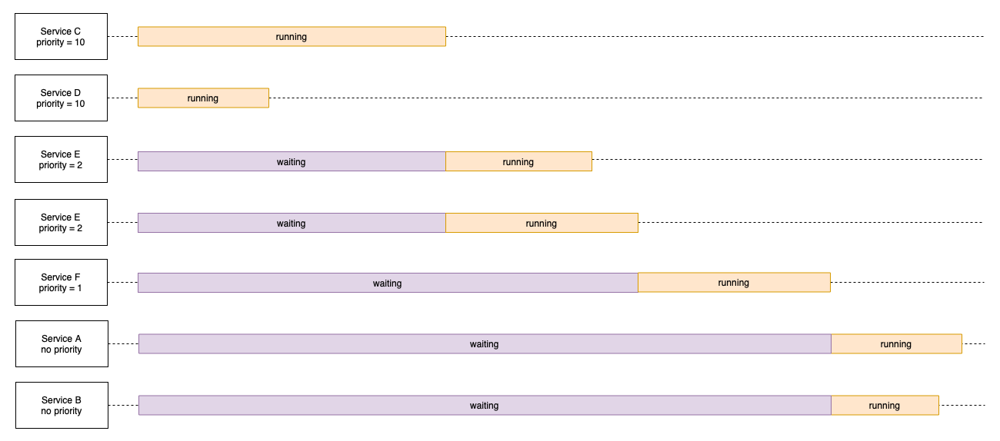

# Export & import of Zerops projects and services structure

Zerops export and import functionality can be used to make a copy of an existing project/service or as an alternative to adding a new project/service manually through the Zerops GUI. It is important to note that only structure, configuration, and environment variables are exported/imported. Restoring application data related to databases ([PostgreSQL](/documentation/services/databases/postgresql.html#how-to-backup-restore-database-data), [MariaDB](/documentation/services/databases/mariadb.html#how-to-backup-restore-database-data), [KeyDB](/documentation/services/databases/keydb.html#how-to-backup-restore-database-data)), storage ([Object Storage](/documentation/services/storage/s3.html#using-rclone-as-a-local-management-tool), Shared Storage), and engines ([RabbitMQ](/documentation/services/message-brokers/rabbitmq.html#how-to-backup-restore-queues-data)), deploying applications, and setting up [public routing](/documentation/routing/using-your-domain.html) is up to the specific user.

[[TOC]]

## How to export / import a project

There are several places in the Zerops GUI where you can do this. The primary one for export is the main project menu, as shown in the image below. The project will be exported along with all of its services.


You can import the entire project, including all of its services, on the same page you use to manually create a new project.



## How to export / import a service

The place to export a project service is its service menu, as shown below.


Importing a project service can be done in the project menu, as shown in the [image at the top](#how-to-export-import-a-project).

## YAML specification

Zerops uses a YAML definition format to describe the structures. If you carry out a project export, you'll get something similar to the following. You can see two main parts, `project` and `services`. If you export a service separately, only the `services` part will be shown relative to the exported service.

```yaml
project:
  name: Example
  tags:
  - DEMO
  - ZEROPS
services:
- hostname: db
  type: mariadb@10.4
  priority: 2
  mode: HA
- hostname: app
  type: nodejs@14
  priority: 1
  mode: HA
  ports:
  - port: 3000
    httpSupport: true
  - port: 9090
    protocol: UDP
    httpSupport: false
  envVariables:
  - key: jwt_token_secret
    content: M3rW31Ne%T@bRk
  - key: CONNECTION_STRING
    content: ${db_connectionString}
- hostname: sharedstorage
  type: shared-storage
  mode: NON_HA
```

### project

**`project`**

A project structure uses `name`, `description`, and `tags` items.

#### name

`name`: string

A project name. When exported, it's pre-pended by the prefix of `copy of` to differentiate it.

#### description

`description`: string (optional)

A project description, if entered.

#### tags

`tags`: Array[string] (optional)

A sequence of project tags, if entered. Each on a separate line with the opening dash.

### services

**`services`**

A sequence of project services (1~N). Several general items are shared across all service structures, exceptional ones are used only in some cases.

#### hostname

`hostname`: string

A chosen short and descriptive, URL-friendly unique service name. Related to [PostgreSQL](/documentation/services/databases/postgresql.html#hostname-and-port), [MariaDB](/documentation/services/databases/mariadb.html#hostname-and-port), [KeyDB](/documentation/services/databases/keydb.html#hostname-and-port), [Node.js](/documentation/services/runtimes/nodejs.html#port), [Golang](/documentation/services/runtimes/golang.html#port), [PHP](/documentation/services/runtimes/php.html#hostname-and-port), [RabbitMQ](/documentation/services/message-brokers/rabbitmq.html#hostname-and-port), [Object Storage](/documentation/services/storage/s3.html#object-storage-name), and [Shared Storage](/documentation/services/storage/shared.html#shared-storage-name).

#### type

`type`: dictionary

A service type and its chosen version. Each of the following service documentation specifies the options available: [PostgreSQL](/documentation/services/databases/postgresql.html#which-version-to-choose), [MariaDB](/documentation/services/databases/mariadb.html#which-version-to-choose), [KeyDB](/documentation/services/databases/keydb.html#which-version-to-choose), [Node.js](/documentation/services/runtimes/nodejs.html#which-version-to-choose), [Golang](/documentation/services/runtimes/golang.html#which-version-to-choose), [PHP](/documentation/services/runtimes/php.html#which-version-to-choose), [RabbitMQ](/documentation/services/message-brokers/rabbitmq.html#which-version-to-choose), [Object Storage](/documentation/services/storage/s3.html#which-version-to-choose), and [Shared Storage](/documentation/services/storage/shared.html#which-version-to-choose).

#### priority

`priority`: integer [>= 1] (optional)

This allows you to control precisely the order in which the services will be created when the import YML definition is processed. There are situations, for example, when a database service (as MariaDB or PostgreSQL) has to already be running before a new application build phase of a runtime (Node.js, Golang, PHP) is started. The following rules are applied:

* services without the explicit `priority` option are grouped (`priority: 0`) and created last,
* services with the explicit `priority` option are ordered in an descending manner,
* `priority` values may not be unique and do not have to represent a continuous numerical series,
* lower priority services will not be created until all higher priority ones are available.

If more of the same `priority` values exist (including none priorities), the creation of all services within the same priority group is invoked at the exact moment, and the final availability of these services is not explicitly controlled (depends on the service type and other parameters).



#### mode

`mode`: dictionary

Affects whether a service should be run in ==**`HA`**== (High Availability) mode, using 3 or more containers, or ==**`NON_HA`**== mode, using only 1 container. Related to [PostgreSQL](/documentation/services/databases/postgresql.html#ha-non-ha-database-mode), [MariaDB](/documentation/services/databases/mariadb.html#ha-non-ha-database-mode), [KeyDB](/documentation/services/databases/keydb.html#ha-non-ha-database-mode), [Node.js](/documentation/services/runtimes/nodejs.html#ha-non-ha-runtime-environment-mode), [Golang](/documentation/services/runtimes/golang.html#ha-non-ha-runtime-environment-mode), [PHP](/documentation/services/runtimes/php.html#ha-non-ha-runtime-environment-mode), [RabbitMQ](/documentation/services/message-brokers/rabbitmq.html#ha-non-ha-mode), [Object Storage](/documentation/services/storage/s3.html#used-technology) (**always runs in HA mode**), and [Shared Storage](/documentation/services/storage/shared.html#default-hardware-configuration-and-autoscaling) (**always runs in HA mode**).

#### ports

`ports`: Array[ServicePort] (optional)

A sequence of service ports (1~N). Each one contains `port`, `protocol`, and `httpSupport` items.

Required only for the [Node.js](/documentation/services/runtimes/nodejs.html#port) and [Golang](/documentation/services/runtimes/golang.html#port) runtime environment services, where you can set or change it. **You have to enter at least one port.** The rest of the services have preset ports which can't be changed. That's why this part is not included at the service level, and if entered, is ignored.

##### port

`port`: integer

A chosen port number.

##### protocol

`protocol`: dictionary (optional)

A chosen protocol. The default value is the ==`TCP`== and it does not have to be entered. The other possible option is the ==`UDP`== value.

##### httpSupport

`httpSupport`: boolean (optional)

The default value ==`true`== indicates if a web server runs on the port (HTTP application protocol is supported), otherwise value ==`false`== is used. If enabled, it means that you can even map [public Internet domains](/documentation/routing/using-your-domain.html#using-your-domain-to-access-a-service) with the option of automatic support for SSL certificates (it also works for [Zerops subdomains](/documentation/routing/zerops-subdomain.html#zerops-subdomain-for-previews)).

#### envVariables

`envVariables`: Array[EnvironmentVariable] (optional)

A sequence of [service environment variables](/documentation/environment-variables/how-to-access.html) (0~N). Each one contains `key` and `content` items.

##### key

`key`: string

An environment variable key.

##### content

`content`: string

An environment variable content.

#### nginxConfig

`nginxConfig`: string (optional)

This is required only for the [PHP+Nginx](/documentation/services/runtimes/php.html#default-nginx-config) and the Nginx [Static server](/documentation/services/static-servers/nginx.html#default-nginx-config) services. The value represents the required content of the configuration `nginx.conf` file used by the Nginx server. Part of that configuration is also setting a document root value.

For example, this could be the exported value if a user accepts the default setting when creating the PHP+Nginx service in the Zerops GUI.

```yaml
services:
  - hostname: phpnginx
    type: php-nginx@8.0
    mode: NON_HA
    nginxConfig: |
      server {
        listen 80;
        listen [::]:80;
        
        server_name _;
        # Be sure that you set up a correct document root!
        root /var/www/public;
        
        location / {
          try_files $uri /index.php$is_args$args;
        }
        
        location ~* \.php$ {
          fastcgi_pass unix:/var/run/php/php8.0-fpm.sock;
          fastcgi_split_path_info ^(.+\.php)(/.*)$;
          include fastcgi_params;
          fastcgi_param SCRIPT_FILENAME $realpath_root$fastcgi_script_name;
          fastcgi_param DOCUMENT_ROOT $realpath_root;
          internal;
        }
        
        access_log syslog:server=unix:/dev/log,facility=kern default_short;
        error_log syslog:server=unix:/dev/log,facility=kern;
      }
```

And this is an example for the same when creating the Nginx Static server service in the Zerops GUI.

```yaml
services:
  - hostname: nginx
    type: nginx@1.18
    mode: NON_HA
    nginxConfig: |
      server {
          listen 80 default_server;
          listen [::]:80 default_server;
          
          server_name _;
          # Be sure that you set up a correct document root!
          root /var/www/public;
          
          location / {
              try_files $uri $uri/ =404;
          }
          
          access_log syslog:server=unix:/dev/log,facility=local1 default_short;
          error_log syslog:server=unix:/dev/log,facility=local1;
      }
```

#### objectStorageDiskGBytes

`objectStorageDiskGBytes`: integer (optional)

This is required only for the [Object Storage](/documentation/services/storage/s3.html#required-disk-capacity) service. The value represents the required maximum amount of data in GB the Object Storage Service should be capable of holding. The preset value in the Zerops GUI is ==`2`== GB.

#### buildFromGit

`buildFromGit`: string (optional)

A public Git URL of a repository should be cloned by Zerops and used for building such a service, including the branch name. It allows for fully automatic processing of the same steps that can be taken manually by a user in the Zerops GUI (including selecting the `Build immediately after the service creation` checkbox). **There is a strict condition: The repository has to be public.**

The format of the URL should be: `https://<domain>@<branchName>`

Related only to [Node.js](/documentation/services/runtimes/nodejs.html#how-to-deploy-application-code), [Golang](/documentation/services/runtimes/golang.html#how-to-deploy-application-code), and [PHP](/documentation/services/runtimes/php.html#how-to-deploy-application-code) runtime environment services.

## Current known limitations

1. It's not possible to use private repositories in combination with the `buildFromGit` item. If you want to import a service related to a private repository, you have to connect it manually in the Zerops GUI.

2. You have to configure your [domain](/documentation/routing/using-your-domain.html), or [Zerops subdomain](/documentation/routing/zerops-subdomain.html) access directly in the Zerops GUI.

<!-- markdownlint-disable DOCSMD004 -->
::: warning Secure access from the external Internet
Before allowing access to a service from the external Internet, it's important to be aware of potential security risks if this service **doesn't have an authentication mechanism implemented** to prevent accidental anonymous user access. Remember that it's possible to use the Zerops [zcli VPN](/documentation/cli/vpn.html) and access a service like this securely through the URL `http://<hostname>:<port>` inside your Zerops project network without allowing external access at all.
:::
<!-- markdownlint-enable DOCSMD004 -->

3. When using shared storage services, neither the export nor the import is able to process the [storage mounting points](/documentation/services/storage/shared.html#storage-mounting) in relation to [Node.js](/documentation/services/runtimes/nodejs.html#accessing-a-zerops-shared-storage), [Golang](/documentation/services/runtimes/golang.html#accessing-a-zerops-shared-storage), and [PHP](/documentation/services/runtimes/php.html#accessing-a-zerops-shared-storage) runtime environment services.

4. When importing several services, they are created in parallel and asynchronously, without a specific order. You can't affect which one will be instantiated as the first or last.

## Zerops recipes

The concept of pre-made skeletons demonstrates how to set up and use the technologies that Zerops supports. They use the import syntax to allow for the very fast creation of services utilizing such technologies.

Here are some of them:

* [recipe-adminer](https://github.com/zeropsio/recipe-adminer)

Adminer is a full-featured database management tool written in PHP. Unlike phpMyAdmin, it consist of a single file ready to deploy to the target server. Adminer is available for MySQL, MariaDB, PostgreSQL, SQLite, MS SQL, Oracle, Elasticsearch, and others via a plugin.
