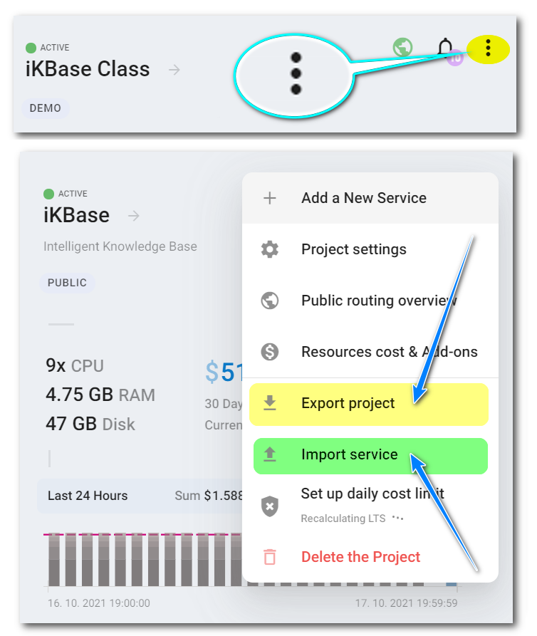

# Export & import of Zerops projects and services structure

The concept of Zerops export and import functionality can be explained in the example of two primary areas where you can use it effectively.

1. Obtaining a simple skeleton of an existing project or its services, created step by step in the Zerops GUI and using it to automate the creation of the same project/services or creating a new copy of them. The skeleton doesn't contain any application data, only the structure and configuration setting. **It's ready for daily use.**

2. Ability to create more sophisticated skeletons and use them to simulate different project scenarios, testing and validation, including a fully prepared skeleton to re-create Zerops projects from the ground on one click or as a part of other automation scripts. **It is not available yet.** However, it is possible to perceive it as the target where Zerops is heading in this area.

## How to get exports

You can find several places in the Zerops GUI to get them. For the whole project, it's primarily the project main menu, as shown on the following picture.



For each project service, it's a similar service menu as shown below.


## Used format and how it looks

Zerops uses a YAML definition format to describe the structures. If you make a project export, you can get something similar to the following. You can see two main parts, `project` and `services`. If you export a service separately, only the `services` part is there with that one exported service.

```yaml
project:
  name: copy of iKBase Class
  description: Intelligent Knowledge Base
  tags:
  - DEMO
  - ZEROPS
services:
- hostname: golang
  type: go@1
  mode: NON_HA
  ports:
  - port: 8088
    httpSupport: true
  - port: 9090
    protocol: UDP
    httpSupport: false
  startCommand: ./bin/main.exe
- hostname: phpapache
  type: php-apache@8.0
  mode: NON_HA
  documentRoot: /var/www/public
- hostname: objectstorage
  type: object-storage@1
  mode: HA
  objectStorageDiskGBytes: 2
- hostname: sharedstorage
  type: shared-storage@1
  mode: HA
```

## Available syntax

**Project keywords**:

`name` <string>

Existed project name, pre-pended by a prefix of `copy of` to differentiate it.

`description` <string> (optional)

Project description, if entered.

`tags` Array<string> (optional)

A set of project tags, if entered. Each of them on a separate line with the opening dash.

**Service keywords**:

`- hostname` <string> (the opening dash required)

A chosen short and descriptive URL-friendly unique service name. Related to [MariaDB](/documentation/services/databases/mariadb.html#hostname-and-port), [MongoDB](/documentation/services/databases/mongodb.html#hostname-and-port), Redis, [Node.js](/documentation/services/runtimes/nodejs.html#port), [Golang](/documentation/services/runtimes/golang.html#port), [PHP](/documentation/services/runtimes/php.html#hostname-and-port), Elasticsearch, RabbitMQ, [Object Storage](/documentation/services/storage/s3.html#object-storage-name), and [Shared Storage](/documentation/services/storage/shared.html#shared-storage-name).

`type` <keyword>

Service type and chosen version. Related to [MariaDB](/documentation/services/databases/mariadb.html#version-to-choose), [MongoDB](/documentation/services/databases/mongodb.html#version-to-choose), Redis, [Node.js](/documentation/services/runtimes/nodejs.html#version-to-choose), [Golang](/documentation/services/runtimes/golang.html#version-to-choose), [PHP](/documentation/services/runtimes/php.html#version-to-choose), Elasticsearch, RabbitMQ, [Object Storage](/documentation/services/storage/s3.html#version-to-choose), and [Shared Storage](/documentation/services/storage/shared.html#version-to-choose).

`mode` <keyword>

Affects whether a service should be run in ==**`HA`**== (High Availability) mode, using 3 or more containers, or ==**`NON_HA`**== mode, using only 1 container. Related to [MariaDB](/documentation/services/databases/mariadb.html#ha-non-ha-database-mode), MongoDB, Redis, [Node.js](/documentation/services/runtimes/nodejs.html#ha-non-ha-runtime-environment-mode), [Golang](/documentation/services/runtimes/golang.html#ha-non-ha-runtime-environment-mode)), [PHP](/documentation/services/runtimes/php.html#ha-non-ha-runtime-environment-mode), Elasticsearch, RabbitMQ, [Object Storage](/documentation/services/storage/s3.html#used-technology) (**always runs only in HA mode**) , and [Shared Storage](/documentation/services/storage/shared.html#default-hardware-configuration-and-autoscaling) (**always runs only in HA mode**).

`ports` Array<port> (optional)

A set of service ports. Each set contains `port`, `protocol`, and `httpSupport` properties.

Related only to [Node.js](/documentation/services/runtimes/nodejs.html#port) and [Golang](/documentation/services/runtimes/golang.html#port) runtime environment services, where you can change it. The rest of the services have the ports preset, and you can't change them. That's the reason why this part is not included at their level, and if entered, it's ignored.

`- port` <integer> (the opening dash required)

Chosen port number.

`protocol` <keyword> (optional)

Chosen protocol. The default value is the ==`TCP`== and it does not have to be entered. The other possible option is the ==`UDP`== value.

`httpSupport` <boolean> (optional)

The default value ==`true`== indicates if a web server runs on the port (HTTP application protocol is supported), otherwise value ==`false`== is used. If enabled, it means that you can even map [public Internet domains](/documentation/routing/using-your-domain.html#using-your-domain-to-access-a-service) with the option of automatic support for SSL certificates (it also works for [Zerops subdomains](/documentation/routing/zerops-subdomain.html#zerops-subdomain-for-previews)).

