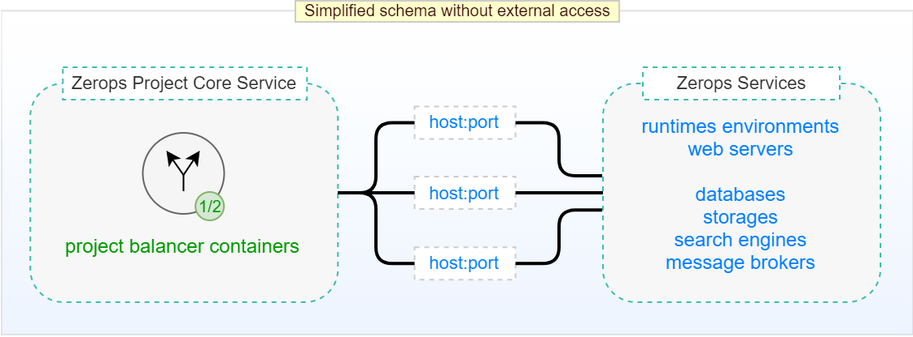

# How Zerops works inside

Zerops infrastructure is built from the ground up based on the experience we acquired over more than 13 years running our own Tier 3 data center at VSHosting. It’s built on open source and well-tested technologies, such as the lightweight [Linux Containers](https://linuxcontainers.org) we chose over more clunky VM solutions. Let’s take a look at how the Zerops project looks inside ... :point_down:

## Typical functional schemas of Zerops Projects

### Without external access

This means no access from outside of Zerops project infrastructure, such as the Internet. In this case, there's only communication between Zerops Project Core Service and any of Zerops Services ([databases](/documentation/services/databases.html), runtimes environments, web servers, storages, search engines, message brokers) through the private network. Zerops Project Core Service is the heart of each Zerops project. It's a part of [Project Basic Package](/documentation/overview/pricing.html#projects) pricing logic.

The essential parts are two running instances of a **project balancer** (one in an active state and the other in a standby backup state) through which all communication is passing.

:::: tabs
::: tab Schema of Zerops Project

:::
::: tab Detail of Project Core Service

Technically, the project balancer is a Layer 3 balancer (establishing connections only on the transport layer, i.e., TCP, UDP). An independent **scaling controller** monitors and controls [vertical scaling](/documentation/automatic-scaling/how-automatic-scaling-works.html#vertical-scaling) (vCPU, RAM, Disk) for both project balancer containers. An independent **repair controller** is then responsible for removing any container that exhibit abnormal behavior and subsequently replacing them with new one.

This ensures a high degree of reliability and stability for all traffic at any time. Each of them runs in a different container located on a **different physical machine**. An independent **activity controller** continuously monitors critical operating parameters of both project balancers. If the currently active instance shows any abnormalities, the running standby backup gets activated instead. From an external perspective, this change is not noticeable in any way.

You can also see details regarding the two remaining project core controllers. The **statistics one** is used for storing metrics of operational parameters of all project and service containers, and the **logger one** for recording all events. The legend can help you orient yourself.

:::
::::

### With external access

This means access from outside of Zerops project infrastructure, such as the Internet. The role of a **project balancer** is extended to public port routing and firewall and provides secure data communication between the Internet and your project. Again, all communication is passing through, either private network traffic or traffic concerning the Internet.

As mentioned earlier, the optional [firewall](/documentation/routing/access-through-ip-and-firewall.html) allows you to explicitly deny or allow access from the external Internet to each of the project's [public accessible ports](/documentation/routing/access-through-ip-and-firewall.html). For runtime environments or web servers services, it essentially means that any port (except 80 or 443 ports) in combination with an assigned IPv4 or IPv6 address can be made public in this way (each project has only one free IPv6 or optionally one paid IPv4 as an add-on). For the rest of services (databases, storages, search engines, message brokers), you have to use our [dev tools](/documentation/cli/vpn.html) (VPN access and Zerops CLI). It is, for example, a case when you want to access database MariaDB Service on its native 3306 port.

In addition, as a general principle, you can use activated Zerops [subdomains](/documentation/routing/zerops-subdomain.html) (`*.app.zerops.io`) or [your public domains](/documentation/routing/using-your-domain.html) if you have pointed their DNS A or AAAA records to those assigned IPv4 or IPv6 addresses on HTTP (80) or HTTPS (443) ports. **Zerops Routing Service** is started with defining the first of these public routing rules. This service, among other things, also takes care of SSL certificate management and internal translation of HTTPS protocol to HTTP.

:::: tabs
::: tab Schema of Zerops Project

:::
::: tab Detail of Project Core Service

The functionality is principally the same as in the case of Project Core Service without external access. The only additional part is an optional firewall.

:::
::: tab Detail of Routing Service

Technically, the **http balancers** (both in an active state) are Layer 7 balancers (handling all HTTP/S traffic for your project). Again, a **scaling controller** manages [vertical scaling](/documentation/automatic-scaling/how-automatic-scaling-works.html#vertical-scaling) (vCPU, RAM, Disk) for both http balancer containers and a **repair controller** to fix an abnormal behavior of them.

:::
::::