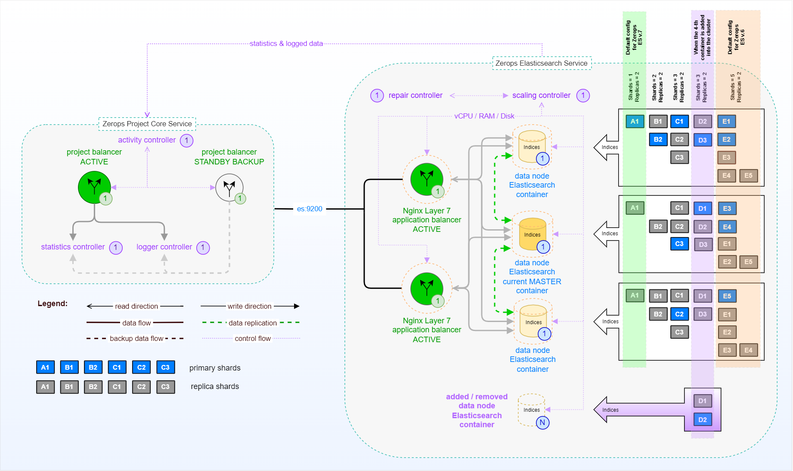

# Elasticsearch Service in HA Mode, Internal

The following picture shows a simplified schema of a standalone [Zerops Elasticsearch Service](/documentation/services/search-engines/elasticsearch.html) in HA mode (with the default of 3 container instances in an [ES cluster](https://www.elastic.co/guide/en/elasticsearch/reference/current/add-elasticsearch-nodes.html)) without external access. This means no access from outside of the Zerops project infrastructure, such as the Internet. Only native access is possible through a private network using a [default port](/documentation/services/search-engines/elasticsearch.html#hostname-and-port) **==9200==** from the [Zerops Project Core Service](/documentation/overview/how-zerops-works-inside/typical-schemas-of-zerops-projects.html) itself, which is at the heart of each user-defined Zerops project.

## Simplified schema (no external access)

[Zerops Elasticsearch Service](/documentation/services/search-engines/elasticsearch.html) shares the [same pricing structure](/documentation/overview/pricing.html#services) as other Zerops services. Two instances of a **[load balancer (Nginx Layer 7)](https://www.nginx.com/resources/glossary/layer-7-load-balancing)** (both in the active state) play a crucial role and control the routing of user requests in tandem. They always direct requests to the least busy instance of the Elasticsearch service. An independent **scaling controller** monitors and controls [vertical scaling](/documentation/automatic-scaling/how-automatic-scaling-works.html#vertical-scaling) (vCPU, RAM, Disk) for all load balancers and ES containers. To ensure optimal performance, the Elasticsearch cluster always starts with 3 instances, and [horizontal scaling](/documentation/automatic-scaling/how-automatic-scaling-works.html#horizontal-scaling) (number of containers) subsequently begins to play a role in response to changing loads (read more about how to [choose the right mode](/documentation/services/search-engines/elasticsearch.html#ha-non-ha-mode) for the Elasticsearch service). An independent **repair controller** is then responsible for removing any containers that exhibit abnormal behavior and subsequently replacing them with new ones.

Both load balancers or Elasticsearch service containers are located on **different physical computers** to prevent service outages in the event of any fatal failure on a single physical computer. Below, you can see the same schema as before, this time including all relationships between internal parts.

## Extended schema (no external access)

Data in each Elasticsearch cluster data node is organized into [indices](https://www.elastic.co/guide/en/elasticsearch/guide/2.x/_add_an_index.html) (indexes). Each index is made up of [one or more shards](https://www.elastic.co/blog/how-many-shards-should-i-have-in-my-elasticsearch-cluster). A shard is the unit at which Elasticsearch distributes data around the cluster and each shard can have multiple copies (replicas). These copies are known as a 'replication group' and must be kept in sync when documents are added or removed. Each shard is an instance of a [Lucene](https://www.elastic.co/celebrating-lucene) index, which you can think of as a self-contained search engine that indexes and handles queries for a subset of data in an Elasticsearch cluster.

The purpose of replication is both to ensure high availability and to improve search query performance, although the main purpose is often to be more fault tolerant. This is accomplished by never storing a **replica shard** on the same node as its **primary shard**. The **current MASTER** data node controls and manages the cluster operational state. If it has a severe problem, the rest of the cluster node members choose a new master.

Regarding the possible [ES versions](/documentation/services/search-engines/elasticsearch.html#version-to-choose) when creating a new service, Elasticsearch **v7** is configured by default in a variant with **one shard and two replicas** and **v6** with **five shards and two replicas**.

<!-- markdownlint-disable DOCSMD004 -->
::: info Changing the number of shards
You can change the default setting by explicitly specifying the **number_of_shards** option while creating a new index.
:::
::: warning Changing the number of replicas
Don't change the default setting of **two replicas**. Otherwise, you risk the cluster not working as expected. Zerops [horizontal scaling](/documentation/automatic-scaling/how-automatic-scaling-works.html#horizontal-scaling) algorithm supposes that the **number of replicas is always 2**.
:::
<!-- markdownlint-enable DOCSMD004 -->

