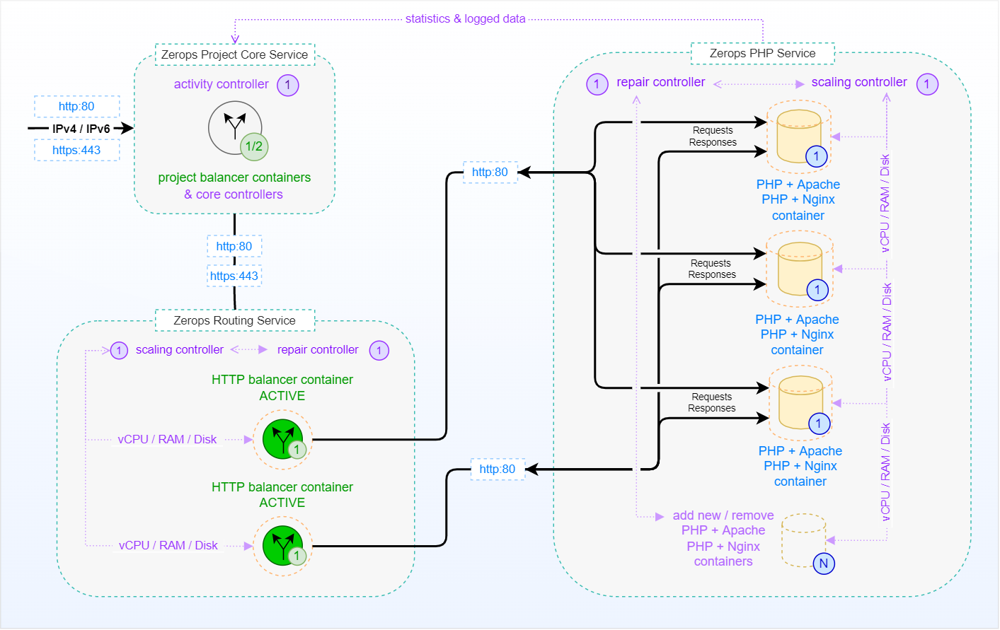

# PHP Service in HA Mode, Internal

The following picture shows a simplified schema of a standalone [Zerops PHP Service](/documentation/services/runtimes/php.html) in HA mode with a default of **3** runtime environment instances (horizontally scaled **up to 64** instances) as a **PHP cluster** without external access. This means no access from outside of the Zerops project infrastructure, such as the Internet. There is only native access through a private network using a [default port](/documentation/services/runtimes/php.html#hostname-and-port) **==80==** from the [Zerops Project Core Service](/documentation/overview/how-zerops-works-inside/typical-schemas-of-zerops-projects.html) itself, which is the heart of each user-defined Zerops project.

## Simplified schema (no external access)

[Zerops PHP Service](/documentation/services/runtimes/php.html) shares the [same pricing structure](/documentation/overview/pricing.html#services) with other Zerops services. The instance of a **[project balancer)](/documentation/overview/how-zerops-works-inside/typical-schemas-of-zerops-projects.html#without-external-access)** plays a crucial role and controls the routing of requests. It always directs the requests to the least busy instance of the PHP runtime environment service. An independent **scaling controller** monitors and controls all PHP runtime environment containers for [vertical](/documentation/automatic-scaling/how-automatic-scaling-works.html#vertical-scaling) (vCPU, RAM, Disk) and [horizontal](/documentation/automatic-scaling/how-automatic-scaling-works.html#horizontal-scaling) (number of containers) scaling. An independent **repair controller** is then responsible for removing any containers that exhibit abnormal behavior and subsequently for replacing them with new ones.

PHP service containers are located on **different physical computers** to prevent service outages in the event of any fatal failure on a single physical computer. Below, you can see the same schema as before, this time including all relations among the internal parts, including external access. More about how the Zerops project works with [external access](/documentation/overview/how-zerops-works-inside/typical-schemas-of-zerops-projects.html#with-external-access).

## Extended schema (with external access)

**Zerops Routing Service** takes care of SSL certificate management and internal translation of HTTPS protocol to HTTP for all project's services, including Zerops PHP Services. Both active **HTTP balancers** again direct the requests to the least busy instance of the PHP runtime environment service.

