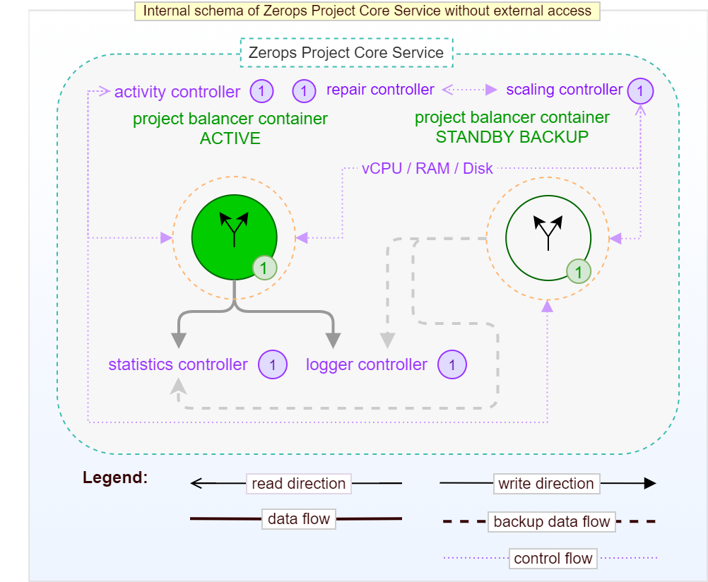
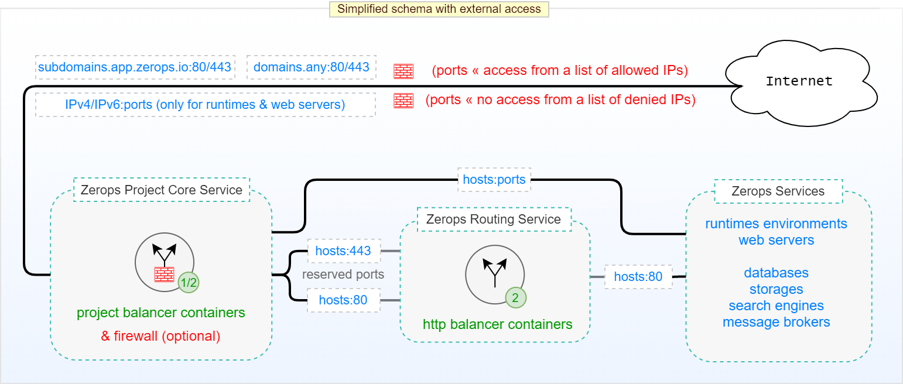
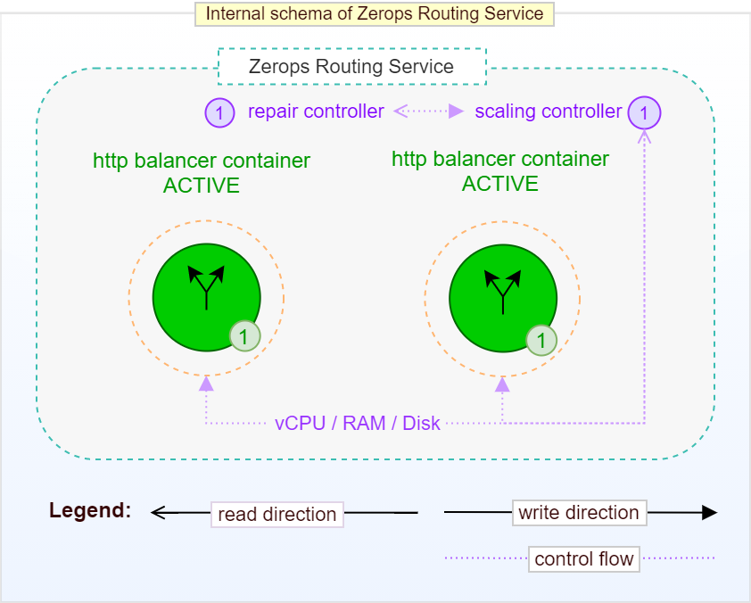

# Project & Service Structure

## Project

The Zerops project is a group of services united by a name. It can, for example, consist of a nodejs [runtime](/documentation/services/runtimes.html) with a mongo [database](/documentation/services/databases.html) and an object storage.

We [encourage](/documentation/overview/made-for-developers.html#each-developer-should-have-his-own-account-no-artificial-pricing-boosting) you to create a project for each environment, i.e. `myapp-production`, `myapp-stage`, `myapp-devel`, or even for each developer, i.e. `myapp-johnd`. You can add an unlimited number of projects, you only [pay for the usage](/documentation/overview/pricing.html) that goes over the [free basic performance](/documentation/overview/pricing.html#free-tier-unlimited-projects-and-team-members). That way, each developer can have their own copy of a project to develop on, utilizing our powerful [dev tools](/documentation/cli/vpn.html).

All services inside the project share a [private network](/documentation/routing/routing-between-project-services.html) and can see and reference [environment variables](/documentation/environment-variables/how-to-access.html) from other services.

Each project has a unique [IPv6 address](/documentation/routing/unique-ipv4-ipv6-addresses.html) assigned and optionally an [IPv4 address](/documentation/routing/unique-ipv4-ipv6-addresses.html) as well. You can then either set up public access through [domains](/documentation/routing/using-your-domain.html) and point your DNS records to the assigned IP addresses, or set up direct access to the service through the IP by [opening public ports](/documentation/routing/access-through-ip-and-firewall.html). Direct access can be managed by a built in [firewall](/documentation/routing/access-through-ip-and-firewall.html).

 

### Typical functional schemas of Zerops Projects

#### Without external access

This means no access from outside of Zerops project infrastructure, such as the Internet. Zerops Project Core Service is the heart of each Zerops project. It has its own [pricing logic](/documentation/overview/pricing.html#projects). The essential parts are two running instances of a **project balancer** (one in an active state and the other in a standby backup state) through which all communication is passing. Technically it's a Layer 3 balancer (establishing connections only on the transport layer, i.e., TCP, UDP). In this case it's communication between Zerops Project Core Service and any of Zerops Services ([databases](/documentation/services/databases.html), runtimes environments, storages, search engines, web servers, message brokers) through the private network.

This ensures a high degree of reliability and stability for all traffic at any time. Each of them runs in a different container located on a **different physical machine**. An independent **activity controller** continuously monitors critical operating parameters of both project balancers. If the currently active instance shows any abnormalities, the running standby backup gets activated instead. From an external perspective, this change is not noticeable in any way.

An independent **scaling controller** monitors and controls [vertical scaling](/documentation/automatic-scaling/how-automatic-scaling-works.html#vertical-scaling) (vCPU, RAM, Disk) for both project balancer container. An independent **repair controller** is then responsible for removing any container that exhibit abnormal behavior and subsequently replacing them with new one.

:::: tabs
::: tab Schema of Zerops Project

:::
::: tab Detail of Project Core Service

:::
::::

#### With external access

This means access from outside of Zerops project infrastructure, such as the Internet. The role of a **project balancer** is extended to public port routing and firewall. Again, all communication is passing through, either private network traffic or traffic concerning the Internet.

:::: tabs
::: tab Schema of Zerops Project

:::
::: tab Detail of Project Core Service

:::
::: tab Detail of Routing Service

:::
::::

## Service

Services are the most important part of Zerops. Each service consists of a cluster of Linux containers running a Zerops managed image of a technology, whether it's a [runtime](/documentation/services/runtimes.html), [database](/documentation/services/databases.html), [storage](/documentation/services/storage.html) or a [static webserver](/documentation/services/static-server.html)). Each service has a hostname and an _n_ number of [ports](/documentation/routing/routing-between-project-services.html), it can be made [public via a domain](/documentation/routing/using-your-domain.html) in case of HTTP(s) services, or via an [IP adress and a port](/documentation/routing/access-through-ip-and-firewall.html).

 

A project can contain an [unlimited number of services](/documentation/overview/made-for-developers.html#each-developer-should-have-his-own-account-no-artificial-pricing-boosting). Services are of different types and depending on their type they are either fully managed by Zerops, or partially managed by Zerops while giving you straightforward management abilities through the Zerops app.

 

 

### Runtime services
[Node.js](/documentation/services/runtimes.html#node-js), [Golang](/documentation/services/runtimes.html#golang), [PHP](/documentation/services/runtimes.html#php)

### Database services
[MariaDB (MySQL)](/documentation/services/databases.html#mariadb-mysql), [MongoDB](/documentation/services/databases.html#mongodb), [Redis](/documentation/services/databases.html#redis), [Elasticsearch](/documentation/services/databases.html#elasticsearch), 

## Message broker services 
[RabbitMQ](/documentation/services/databases.html#rabbitmq)

### Static webserver
[Nginx](/documentation/services/static-server.html)

### Storage services
[Shared storage](/documentation/services/storage.html#shared-storage), [S3 compatible Object Storage](/documentation/services/storage.html#s3-compatible-object-storage)

 

::: warning Internal services
Each project also has one or two internal services. A core service, which provides secure data communication between the Internet and your project, storage for application logs and technical statistics. And an l7 balancer, which handles HTTP(s) traffic from the Internet to your applications, HTTP(s) routing over Zerops subdomain or your own domain and SSL certificates.
:::
