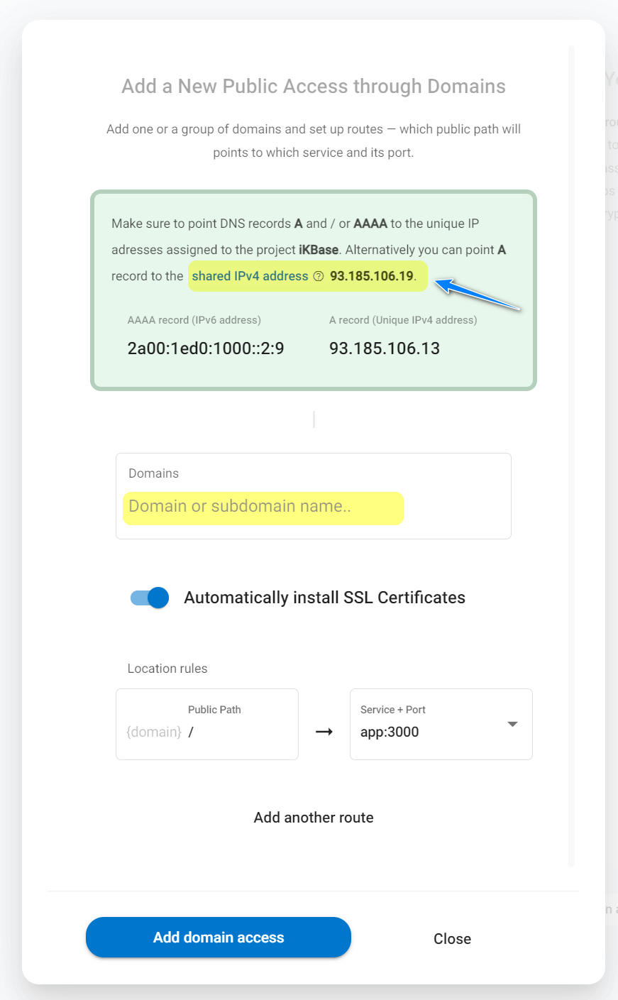

# Using a shared IPv4 address in Zerops

In addition to the fact that each Zerops [project](/documentation/overview/pricing.html#projects) you create will always be assigned a [unique IPv6 address](/documentation/routing/unique-ipv4-ipv6-addresses.html) (with the option to purchase [unique IPv4 addresses](/documentation/routing/unique-ipv4-ipv6-addresses.html)) as part of the core functionality, you also have the option to use a shared IPv4 address ==`93.185.106.19`== **without any additional fee**. It allows you to set up your **A record** of your public [domain access](/documentation/routing/using-your-domain.html).

<!-- markdownlint-disable DOCSMD004 -->
::: warning AAAA record must always be set up
The shared IPv4 will work for you only when you correctly set up a project dedicated IPv6 (with no cost) to the AAAA record because it's used internally in Zerops for the routing.
:::
<!-- markdownlint-enable DOCSMD004 -->

If you already have set up the A record of your public domain (for example, ==`mydomain.com`== ) to the shared IPv4 address of ==`93.185.106.19`== in the DNS configuration of your domain name registrar, together with the AAAA record to the dedicated project's IPv6 address, enter the domain name into the **Domains** form input. Zerops automatically handles everything else.

## Known specifics

* Zerops shared IPv4 address can be used only for HTTP routing, not general port routing.

* Because it is the IPv4 address shared with all projects in Zerops that may use it, the operation of an individual project may be affected by other projects from the point of view of the throughput limits of its own data traffic and management. For this reason, the use of a shared IPv4 address is directed mainly for development or testing purposes and **does not aim to ensure the production operation of applications**.

* Each application that uses the shared IPv4 address should implement its logic of origin traffic identification (for example, using HTTP headers, cookies, ...) because it **won't recognize the source IP addresses of its users directly** (via the [X-Forwarded-For](https://developer.mozilla.org/en-US/docs/Web/HTTP/Headers/X-Forwarded-For) header). It's due to the path and processing of users' incoming connections in Zerops infrastructure. That's why it's necessary to store the source IP address as metadata on a client-side and parse them on an application server-side. The [X-Forwarded-Host](https://developer.mozilla.org/en-US/docs/Web/HTTP/Headers/X-Forwarded-Host), [X-Forwarded-Proto](https://developer.mozilla.org/en-US/docs/Web/HTTP/Headers/X-Forwarded-Proto) headers work as usual.
