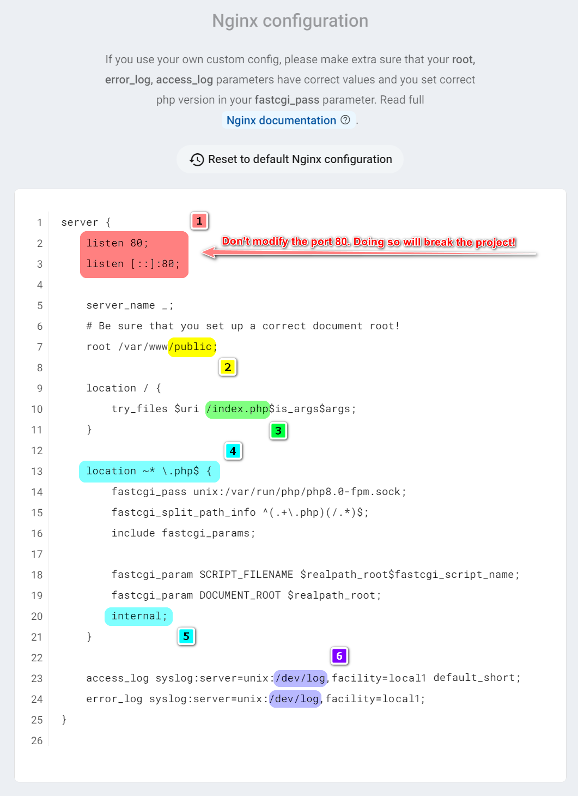

# PHP

[[toc]]

## Adding the PHP Service in Zerops

### Version to choose

You can currently choose a PHP engine **v8.0**, **v7.4**, or **v7.3**. The chosen version of it **can't be changed afterward**. Switching must be done manually by creating a new service with another version and migrating project code using a new [build](/documentation/build/how-zerops-build-works.html)/[deploy](/documentation/deploy/how-deploy-works.html) process.

Along with the choice of the engine, you can also choose between two host web servers in which it can run. It's either **Apache v2.4** or **Nginx v1.18**. There are specific configuration differences between both that need to be perceived and respected. These will always be listed and explained below.

### Hostname and port

Choose a short and descriptive URL-friendly name, for example, **php**. The following rules apply:

* maximum length **==25==** characters,
* only lowercase ASCII letters **==a-z==** and numbers **==0-9==**,
* **==has to be unique==** in relation to other existing project hostnames,
* the hostname **==can't be changed==** later.

The port will automatically be set to the value of **==80==** and can't be changed.

### Project code root and Document root

The **project code** will always be placed in ==**/var/www**== folder, regardless of which deployment variant you choose. Another thing is where you place the so-called **document root** (usual location of the ==index.php== or ==index.html== file), which is the user configuration setting. You can place it, for example, in a subdirectory like **public** (optional name) or keep it identical with the project code root.

<!-- markdownlint-disable DOCSMD004 -->
::: tip Recommendation
Using a subdirectory like ==**/var/www/public**== for a document root is always a good idea. This allows you to use the code root directory for the project's overhead stuff and improve the readability of the directory structure so.
:::
<!-- markdownlint-enable DOCSMD004 -->

#### Setting PHP/Apache document root

You set it through a separate input.


#### Setting PHP/Nginx document root

You set it through a project Nginx configuration file at marked point [**2**] (with the pre-defined content specific for each PHP engine version) that you can modify as you want with one exception, **==don't modify the port 80==** at marked point [**1**]. Otherwise, you will break the project.



The Nginx configuration above also defines which file (**index.php** here) at marked point [**3**] is used for serving a document root content.

The location defined at the marked point [**4**] blocks access to any `*.php` file for external requests (case insensitive) using the directive **internal** at the marked point [**5**]. Any try to access leads to a **404 Not Found** response then.

If you want to allow an external access to `*.php` files in a subdirectory, for example, `app`, you need to add a new location:

```nginx
location ^~ /app/ {
   fastcgi_pass unix:/var/run/php/php7.4-fpm.sock;
   fastcgi_split_path_info ^(.+\.php)(/.*)$;
   include fastcgi_params;

   fastcgi_param SCRIPT_FILENAME $realpath_root$fastcgi_script_name;
   fastcgi_param DOCUMENT_ROOT $realpath_root;
}
```

### Three variants how to deploy the project code
