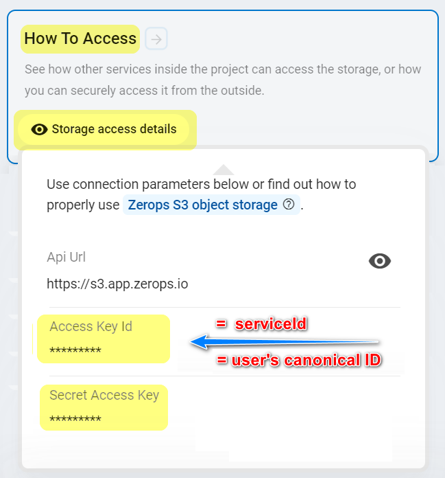

# S3 compatible object storage

Zerops provides a fully managed and scaled S3 compatible object storage service, suitable for both development and production projects using any load. You can choose any option you want and be sure that it will work. Your certainty and peace of mind are our top priority.

## Adding the Object Storage Service in Zerops

### Used technology

Zerops Object Storage is based on the technology of the [Ceph cluster](https://docs.ceph.com/en/latest/architecture) in version [v15.2 OCTOPUS](https://docs.ceph.com/en/latest/releases/octopus), providing interfaces compatible with most of the Amazon S3 RESTful API.

<!-- markdownlint-disable DOCSMD004 -->
::: info
The object storage cluster is running in a HA mode (with multiple node flexibility controlled directly by Zerops) as a directly accessible service in the same way from all Zerops project's services and from the outside Internet through HTTPS protocol. Each new Zerops Object Storage Service creates a reserved and independent space based on the required disk capacity.
:::
<!-- markdownlint-enable DOCSMD004 -->

### Object storage name

Choose a short and descriptive URL-friendly name, for example, **store**. The following rules apply:

* maximum length **==25==** characters,
* only lowercase ASCII letters **==a-z==** and numbers **==0-9==**,
* **==has to be unique==** in relation to other existing project's hostnames,
* the object storage name **==can't be changed==** later.

<!-- markdownlint-disable DOCSMD004 -->
::: info
The object storage name is also automatically used to create a user account under which all buckets and objects are subsequently created. This user is, therefore, their **owner with full access rights**. See [Object storage owner identity](#object-storage-owner-identity) section for more info.
:::
<!-- markdownlint-enable DOCSMD004 -->

### API URL endpoint and port

The Zerops Object Storage service is accessible on [https://s3.app.zerops.io](https://s3.app.zerops.io). The port is always set to the default value of HTTPS protocol **==443==** and can't be changed.

### Required disk capacity

You can choose the maximum amount of data in GB the created Object Storage Service should be capable of holding. The default value is set to **2 GB**, but you can change it as you like between **1** and **100 GB**.

<!-- markdownlint-disable DOCSMD004 -->
::: warning Only manual scaling
Chosen disk capacity is currently not automatically scaled in any way and needs to be changed manually as needed via the Zerops GUI.
:::
<!-- markdownlint-enable DOCSMD004 -->

### Object store bucket names

The [following rules](https://docs.ceph.com/en/latest/radosgw/s3/bucketops/#constraints) apply:

* must be unique,
* cannot be formatted as IP address,
* can be between 3 and 63 characters long,
* must not contain uppercase characters or underscores,
* must start with a lowercase letter or number,
* must be a series of one or more labels separated by a single period ( ==**.**== ),
* can contain lowercase letters, numbers, and hyphens,
* each label must start and end with a lowercase letter or a number.

### Number of buckets per a service

You can create up to 1000 buckets per one Zerops Object Storage Service.

## How to access an object storage service

### Object storage owner identity

For each Zerops Object Storage Service, one account with [canonical id](https://docs.aws.amazon.com/general/latest/gr/acct-identifiers.html) is automatically created with the same name as the chosen [Object storage name](#object-storage-name). Under this account, all buckets and objects are created later, and this user is listed as the owner with the following attributes, as an example:

|DisplayName  |ID                        |Type             |
|:------------|:-------------------------|:----------------|
|==**store**==|==0LW7E_BUT-yKmmEcyf3dzQ==|**CanonicalUser**|

<!-- markdownlint-disable DOCSMD004 -->
::: info
The unique generated id of the created Zerops Object Storage Service instance is used as the canonical **ID** property's value above.
:::
<!-- markdownlint-enable DOCSMD004 -->

### From other services inside the project

Other services can access the object storage using its [API URL endpoint](#api-url-endpoint-and-port) in the same way as any access from the outside Internet through HTTPS protocol and the default ==**443**== port.

In most cases, this will be a way to create application logic within the Zerops runtime environments ([Node.js](/documentation/services/runtimes/nodejs.html), [Golang](/documentation/services/runtimes/golang.html), and [PHP](/documentation/services/runtimes/php.html)) using relevant programming code, ensuring communication and all steps associated with creating and managing buckets and their contents.

Each programming language requires a bit different setting. The following examples show some elementary tasks for each of them. You need to understand each of them and also have knowledge of using appropriate SDKs for more advanced cases and real applications.

* [Using S3 compatible object storage in PHP](/knowledge-base/how-to-do/using-object-storage-in-php.html)
* [Using S3 compatible object storage in Node.js](/knowledge-base/how-to-do/using-object-storage-in-nodejs.html)
* [Using S3 compatible object storage in Golang](/knowledge-base/how-to-do/using-object-storage-in-golang.html)

It's always recommended not to place configuration values as constants directly into the application code. The better way is to use them indirectly, for example, via [custom environment variables](/knowledge-base/best-practices/how-to-use-environment-variables-efficiently.html), referencing Zerops [implicit environment variables](/documentation/environment-variables/helper-variables.htm) and given that [all environment variables](/documentation/environment-variables/how-to-access.html) are shared within the project across all services.

### From local development environment

The Zerops Object Storage service is directly accessible from your local workspace using its public [API URL endpoint](#api-url-endpoint-and-port) through HTTPS protocol. You don't need to utilize the [VPN](/documentation/cli/vpn.html) functionality of our [Zerops zcli](/documentation/cli/installation.html), unlike all other Zerops services.

Because code runs from outside your Zerops project's network, you cannot use references to the environment variables. Therefore, you should copy the values manually through the „**How To Access** / **Storage access details**“ section of the service detail in your application if you need some of them and use them in your private local configuration strategy.

