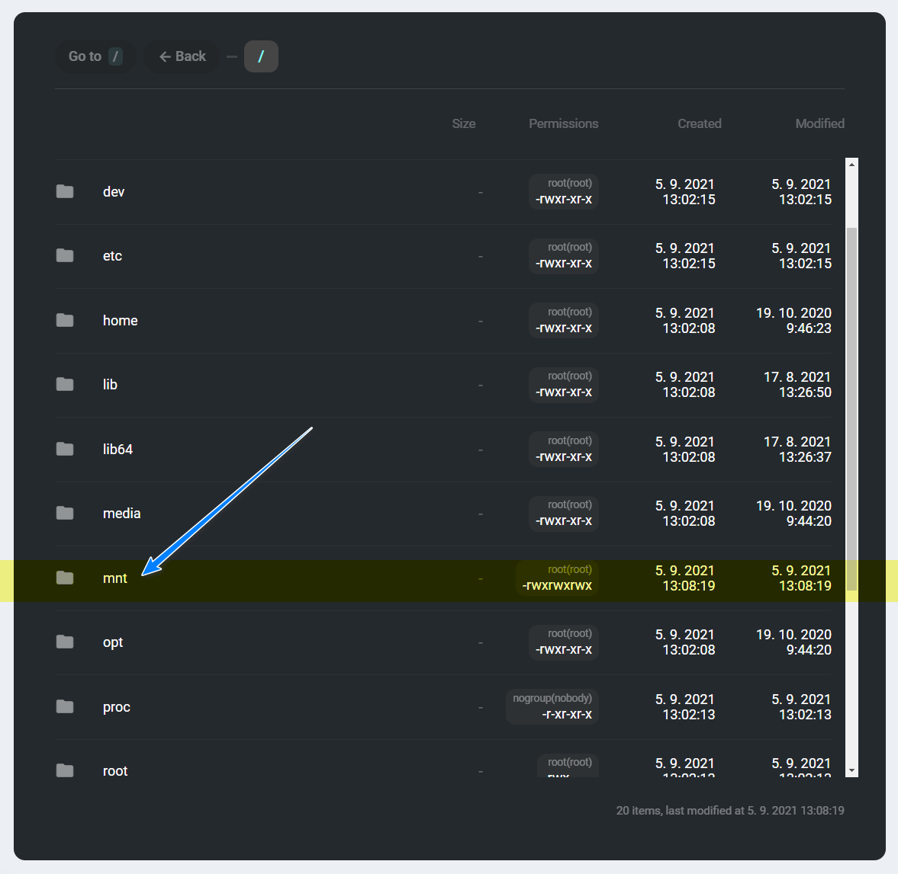

# Shared storage

Zerops provides a fully managed and scaled **shared storage** service (replicated volume) based on the [GlusterFS](https://docs.gluster.org) cluster technology, suitable for both development and production projects using any load. You can choose any option you want and be sure that it will work.

[[toc]]

## Adding the Shared Storage Service in Zerops

### Shared storage name

Choose a short and descriptive URL-friendly name, for example, **disk**. The following rules apply:

* maximum length **==25==** characters,
* only lowercase ASCII letters **==a-z==** and numbers **==0-9==**,
* **==has to be unique==** in relation to other existing project's hostnames,
* the shared storage name **==can't be changed==** later.

<!-- markdownlint-disable DOCSMD004 -->
::: info Relation between shared storage names and hostnames
There's only one namespace for all service hostnames, shared storage names, and object storage names. Each one of them has to be unique against the others.
:::
<!-- markdownlint-enable DOCSMD004 -->

### Storage mounting

A shared storage disk can only be mounted to runtime environment services ([PHP](/documentation/services/runtimes/php.html#accessing-a-zerops-shared-storage), Node.js, Golang).

The mounting is done automatically by **enabling** the corresponding switch for an already existed runtime service to which you want to mount the storage. When you want to do it anytime later after creating the service, return to its **Storage configuration** section on the service details and do the same change.

The previous picture means that the path to the root of such mounted shared storage disk in the PHP service is ==`/mnt/app`== . If you would enable the switch also for **api** (Node.js service), the path could be ==`/mnt/api`== . Here, your application code can create any directory structure and content you need. Access rights are slightly different for each runtime environment. See details for [PHP](/documentation/services/runtimes/php.html#accessing-a-zerops-shared-storage), Node.js, or Golang.

<!-- markdownlint-disable DOCSMD004 -->
::: info 
If you would like to learn more about the technical details and how this service is internally built, take a look at the [Shared Storage Service, Internal](/documentation/overview/how-zerops-works-inside/glusterfs-cluster-internally.html).
:::
<!-- markdownlint-enable DOCSMD004 -->

## Default hardware configuration and autoscaling

* Shared storage service is always instantiated only in HA mode with **3 containers**. It means that any files are always replicated through 3 different physical places. A non-HA version isn't available.
* Each of them runs in a different container located on a **different physical machine** and starts with 1 vCPU, 0.25 GB RAM, and 5 GB of disk space.
* Zerops will automatically scale the resources **only vertically** (up to 32 vCPU, 64 GB RAM, 1 TB disk space).

## How to browse the content

You can use **File browser** functionality available in all runtime services to view folders, files, and their contents & attributes of mounted shared storage disks at the path `/mnt/`.

