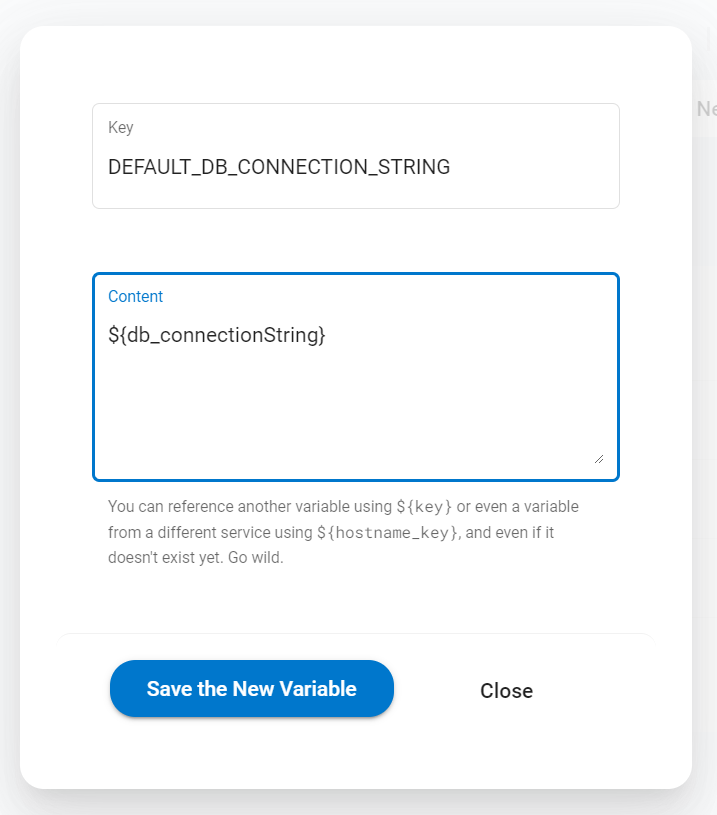

# How to use environment variables efficiently

In general, the use of a direct reference to another service in code is always potentially problematic, especially in those cases where the identification (hostname in our case) of that service may change. The reason is code changes in many places and the following necessary builds and deploys. That's why using a [custom variable](/documentation/environment-variables/how-to-access.html#creating-user-defined-variables) that references an implicit environment [variables](/documentation/environment-variables/helper-variables.html#mariadb) (automatically generated by Zerops) is always in line with the best practices.

For example, if it's necessary to access **MariaDB** service (with **hostname** set to **==db==**) from **Node.js** service, a new custom environment variable, like **DEFAULT_DB_CONNECTION_STRING**, should be created with `${db_connectionString}` formula inside that Node.js service.



After that (service restart is necessary), it's possible to use the following code to get the necessary value.

```javascript
const env = process.env;
const DB_CONNECTION_STRING = env['DEFAULT_DB_CONNECTION_STRING'];
```

When a new MariaDB service is created with a different hostname in the future (with **hostname** set to **==dbnew==**), and it's required to switch to it, the only change would be in the definition of that custom variable to `${dbnew_connectionString}`, and no application code changes are necessary at all.

If **Golang** is used instead of Node.js.

```go
const DB_CONNECTION_STRING = os.LookupEnv('DEFAULT_DB_CONNECTION_STRING')
```

If **PHP** is used instead of Node.js.

```php
<?php
  $DB_CONNECTION_STRING = getenv('DEFAULT_DB_CONNECTION_STRING');
?>
```
